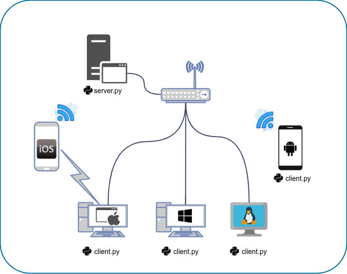
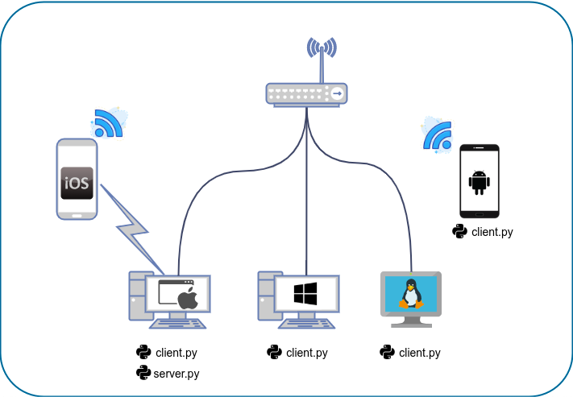

# copy_net_past

## Мультиплатформенный сетевой буфер обмена  

Это инструмент сетевого копирования и вставки текста между Windows, Linux, 
MacOS, iOS*, Android** в локальной сети.  
<small>_*_ между MacOS и iOS - используется функция "непрерывность".</small>  
<small>_**_ любое устройство, где установлен python3.6+</small>

***

### Полезная информация

[Демонстрация объединения буфера между iPhone, Mac и 
Linux](https://www.youtube.com/watch?v=BIfXv44qUz4)

Работает пока только с текстом.  
Иногда подглючивает, но не смертельно).  

***

### Запуск
**Используйте только в своей домашней сети(!)**

1.Запустите файл server.py на любом устройстве в локальной сети, где установлен 
python3.6+.  
После запуска выведется информация: "Start server  - ip : port ".  
По умолчанию используется порт 666.  
В первые 3 секунды после запуска его можно изменить.  

2.Запустите файл client.py на каждом устройстве с общим буфером обмена.  
По умолчанию подключение происходит к серверу 192.168.88.210:666.   
В первые 3 секунды после запуска ip и порт можно ввести любой другой.  
Можно заранее в 85 строке файла client.py - изменить ip и port в функции 
input_server(ip, port, time).

 
server.py может быть запущен как на отдельном устройстве,  
 
так и на том же, где запускаеся client.py.  

***

## Multiplatform network clipboard (win. mac, iphone, linux)  

This is network copy paste text  tool between Windows, Linux, MacOS, iOS*, 
Android** in local network.  

<small>_*_ between MacOS and iOS- used function "continuity".</small>  
<small>_**_ any device where python3.6+ is installed.</small>

***

### Information

[Demonstration of clipboard merging 
between](https://www.youtube.com/watch?v=BIfXv44qUz4)

Works with text only.
Sometimes it crashes, but not fatally).

***
### Run

**Use only on your home network(!)**

1.Run the server.py file on any device on the local network where python3.6+ is installed.  
After starting, information will be displayed: "Start server - ip: port".  
The default port is 666.  
In the first 3 seconds after launch, it can be changed.  

2.Run the client.py file on each device with a shared clipboard.  
By default, the connection is made to the server 192.168.88.210:666.  
In the first 3 seconds after starting ip and port, you can enter any other.  
You can change ip and port in the input_server(ip, port, time) 
function in line 85 of the client.py file in advance.  

 
server.py can be run on a separate device,  
 
or on the same device where run 
client.py.